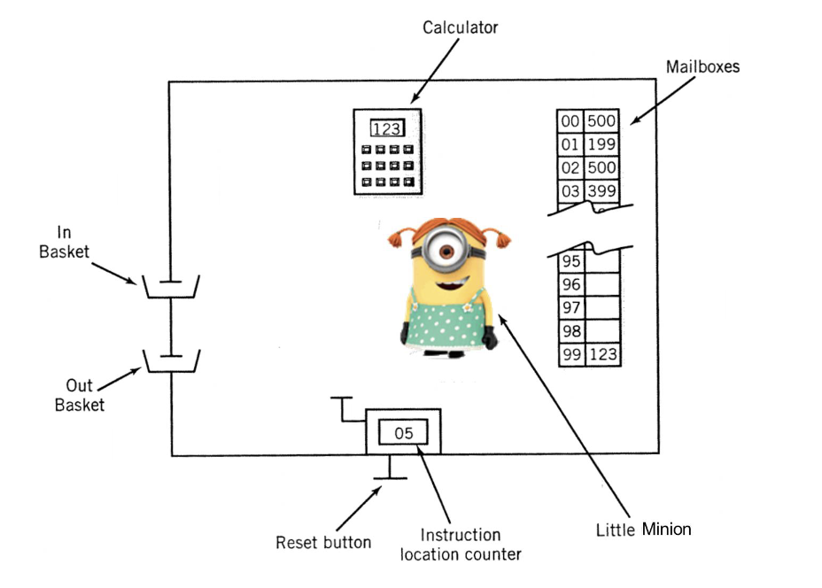

# Little Minion Computer

📌 **LMC** or **L**ittle **M**inion **C**omputer is a toy example of a machine architecture

## Usage

This tool enables both the execution of LMC assembly language, via the LMC VM.
As well as the assembling of LMC assembly language into machine code, via the
assembler.

To run the tool first clone the repo and build the binary:

```sh
$ git clone https://github.com/h5law/lmc
$ cd lmc
$ cargo build -r
$ cp ./target/release/lmc ~/.local/bin
```

After the tool is in your `PATH` you will be able to execute it, assemble LMC
programs and run them.

```sh
$ lmc -h
Usage: lmc <command> <flags>

Commands:
	assemble <input file> <output file>
	execute <input file>
	batch <program file> <batch file>

Flags:
	-h, --help	Show this help message
	-v, --verbose	Show verbose output
	-d, --debug	Show debug output
```

## Batching

The LMC VM supports batch execution for testing your programs. In order to do
this you must first write a program and then a test file. The test file can
preload inputs into the LMC's `input_tray` which is a queue under the hood.

The test file must have the following format:

```
test_name;input1,input2,...,input_n;result;max_cycles
```

Here the only mandatory fields are the `test_name` and number of `max_cycles`,
however even if not included the other fields must be left empty in order to
correctly parse the test file. A test without inputs or result would be:

```
test_name;;;max_cycles
```

## Examples

The [programs](./programs) directory contains some example programs, in both
LMC machine code and LMC assembly that can give some insight into how to write
your own programs and how the VM operates.

## Design



**NOTE:** The LMC uses decimal arithmetic **not** binary arithmetic

### Mailboxes

- Mailboxes = Registers
- 2-digit address space
  - 100 “mailboxes” in total
- Each “mailbox” contains a "slip of paper" with 3-digits on it

### Calculator

- Calculator = CPU
- Operates on 3-digit numbers
  - Add, subtract
  - Has 1 flag
    - NEG
    - Indicates whether a subtraction caused a negative number

### 2-digit Counter

- 2-digit counter = program counter
- has 2 buttons on it
  - first button increments the counter by 1
    - operated internally by the minion
  - second button resets the counter to 00
    - operated externally by the user

### Input and Output Trays

- The user can put slips of paper with 3 digits on them into the input tray
  - these are to be read when the little minion next looks at the tray
- The little minion can write 3 digits on a slip of paper and put them in the
  out tray
  - these are to be read by the user

## Workflow

The little minion controlling the computer follows the steps listed below:

1. Starts by looking at the counter for a mailbox address (xx)

1. The minion then increments the counter by 1

1. The minion goes to the mailbox xx and reads what is written there

   a. reads 3 digits

1. The minion takes the appropriate action depending on those digits

1. Back to step (1)

📌 This is the **fetch and execute cycle**

## Instruction Set

The little minion will read from the 3-digit number on the slip in the mailbox
it was sent to, these are **op-codes** and instruct the little minion as to what to
do.

### **Op Codes**

- **LOAD (op-code 5)**
  - Instruction `5xx`
    - goto mailbox address `xx` and load the 3-digit number into the calculator
  - This is a copy and does not overwrite the mailbox `xx`
- **STORE (op-code 3)**
  - Instruction `3xx`
    - goto the calculator and read the 3-digit number displayed
    - goto mailbox address `xx` and set its contents to be the 3-digit number
      from the calculator
  - This is a copy and does not overwrite the calculator
- **ADD (op-code 1)**
  - Instruction `1xx`
    - goto the mailbox address `xx` and read the 3-digit number stored there
    - goto the calculator and add the number to the number already on the
      calculator
- **SUBTRACT (op-code 2)**
  - Instruction `2xx`
    - goto the mailbox address `xx` and read the 3-digit number stored there
    - goto the calculator and subtract the number from the number already on
      the calculator
    - If the number read from memory address `xx` is larger than the current
      number in the calculator then raise the `NEG` flag
- **I/O (op-codes 901 and 902)**
  - Instruction `901` (**READ**)
    - goto the `IN` tray read the 3-digit number there
    - goto the calculator and enter that number in
  - Instruction `902` (**WRITE**)
    - goto the calculator and read the 3-digit number there
    - goto the `OUT` tray and leave a slip of paper with that number on it
- **BREAK (op-code 000)**
  - Instruction `000`
    - the little minion rests
- **BRANCH (op-code 6)**
  - Instruction `6xx`
    - set the 2-digit counter to the value `xx`
    - start fetch of the execution
    - **unconditional branch**
- **BRANCH on ZERO (op-code 7)**
  - Instruction `7xx`
    - goto the calculator and read the value
      - if zero continue
      - if not zero do nothing else
    - set the 2-digit counter to the value `xx`
    - start fetch of the execution
    - **conditional branch**
- **BRANCH on POSITIVE (op-code 8)**
  - Instruction `8xx`
    - goto the calculator and read the value
      - if `NEG` flag is on continue
      - if `NEG` flag is not present do nothing else
    - set the 2-digit counter to the value `xx`
    - start fetch of the execution
    - **conditional branch**

## Calulcator

In the LMC **all** actions go through the calculator

- To output the value stored in mailbox address `xx`
  - `5xx`
  - `902`
- To read from the input and write to the mailbox address `xx`
  - `901`
  - `3xx`
- To add the values stored in mailbox addresses `xx` and `yy` and store this in
  `xx`
  - `5xx`
  - `1yy`
  - `3xx`

## Fetch and Execute

The steps taken by the little minion are called the **instruction cycle**. The
instruction cycle has 2 stages:

- **Fetch**
  - the little minion finds the instruction to execute
    - the minion goes to the counter
    - reads the address there (and then increments it to be ready for the
      next cycle)
    - the minion goes to the mailbox at that address and reads the 3-digit
      number in the mailbox
- **Execute**
  - the little minion performs the work specified in the instruction
